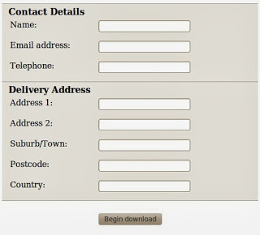
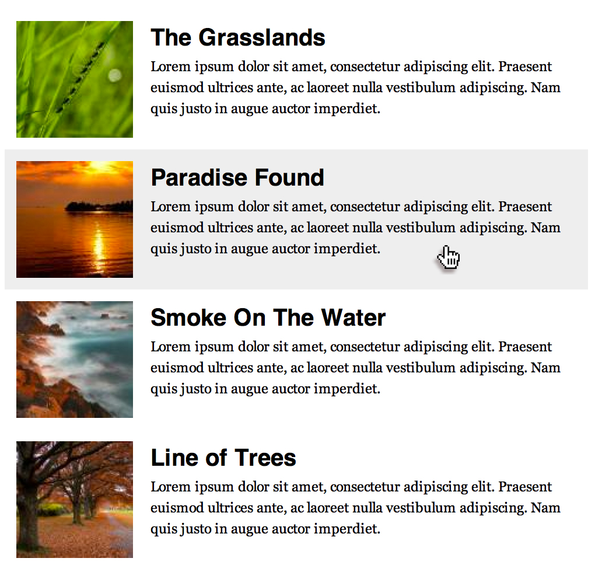
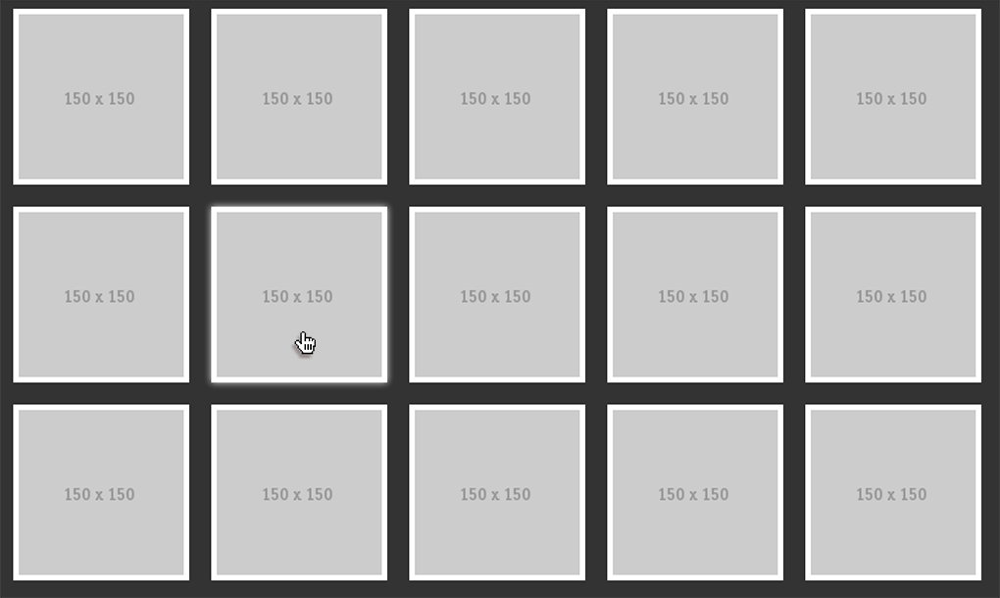

## CSS Styling!

http://www.w3schools.com/tags/ <- List of all tags of HTML lenguage

**Resources** => https://www.w3schools.com/html/default.asp

*Basic estructure for HTML main page*

#### Exercises:

**Maqueta y estiliza las siguientes imágenes de forma que queden lo más exactas posible.**

**a) Basic Markup**
a1)IMG1

---
a2)IMG2

---
a3)IMG3

---
a4)IMG4

---
a5)IMG5

---

**b) Advanced Markup**
b1)IMG1

---
b2)IMG2

---
b4)IMG3

---
b4)IMG4

---
b5)IMG5

---
b6)IMG6

---
