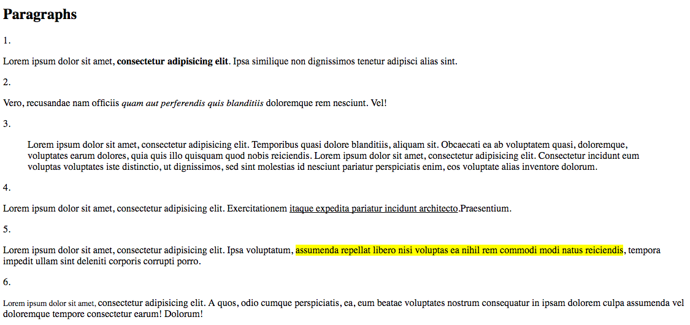
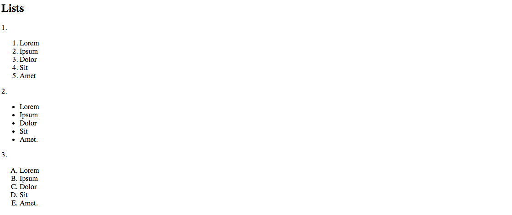
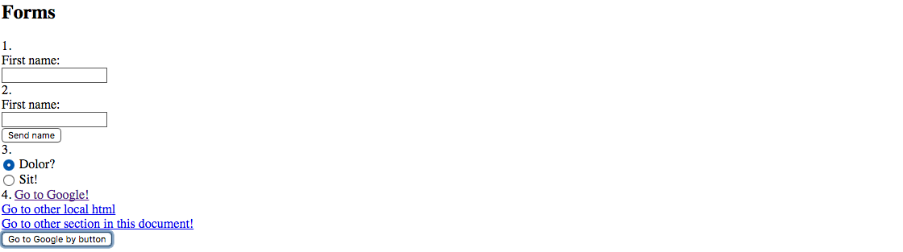

## HTML MARKUP

http://www.w3schools.com/tags/ <- List of all tags of HTML lenguage

**Resources** => https://www.w3schools.com/html/default.asp

*Basic estructure for HTML main page*

#### Exercise:

**FIRST** => https://www.codecademy.com/learn/web

a) Realiza el marcado semántico de las siguientes imágenes(**no styles(css)**, solo marcado HTML!).

## P
**Resources =>** https://www.w3schools.com/html/html_formatting.asp

## Lists

## Forms
**Resources** => https://www.w3schools.com/html/html_forms.asp
