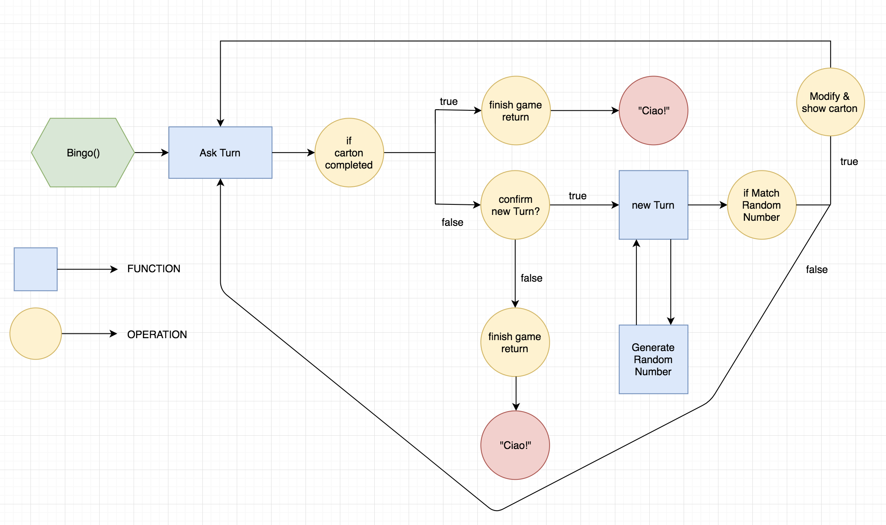

# Challenges Pre-course

## **Mini-Proyecto del <a href="methods.md"> tema 1</a>**

### Calculator! ➗➕

Haz una calculadora. Un único programa al que le pasarás dos parámetros y el usuario podrá visualizar por consola la suma, resta, multiplicación y división entre ambos números. El resultado debería ser mostrado con 3 decimales como mucho (En caso de que hubieran).
El programa debe contemplar y actuar correctamente en el caso de que el usuario introduzca cualquier cosa que no sean números.

- Si el usuario introduce un solo numero, deberá mostrar **SOLO** su raíz cuadrada, si vuelve a introducir los dos, volverá a mostrar las 4 operaciones de siempre.
- Los resultados deberían almacenarse dentro de una array y mostrarlos de una forma amigable al usuario.

*Hint_* => results = [num1 + num2 = resultSum, num1-num2 = resultRest ....]

**PRO.**

- Podrías hacer que le calculadora relizara operaciones sean cuales sean el numero de argumentos pasados a la funcion?
*Hint* => https://developer.mozilla.org/en-US/docs/Web/JavaScript/Reference/Functions/arguments
*Hint* => https://msdn.microsoft.com/es-es/library/he95z461
```javascript
function sum(){
    var acc = 0;
    for (num in arguments){
    console.log(num)
    acc += arguments[num]   
    }
    return acc
}
sum(2,3,4) // acc=9
```

- Después de hacer todas las operaciones, el programa deberá preguntar al usuario si desea volver a realizar otra operación, volviendo a almacenar más resultados y mostrándolos.
```javascript
calculator(n1,n2)
//Output => sum, subs, mult, div...
prompt("New numbers? y/n")
    Case "y" => calculator(n1,n2)
                //Output => sum1, subs1, mult1, div1, sum2, subs2, mult2, div2...
    Case "n" => "Bye!"
```

---

## **Mini-Proyecto del <a href="objects.md"> tema 2 </a>**

### Skylab Airlines! ✈️🛩

*(Los datos de los vuelos están al final del enunciado, podéis usarlos en vuestro código)*

Programa una inferfaz de usuario para una aerolinea (por terminal...). Esta aerolinea dispondrá de 10 vuelos para el dia de hoy, para empezar, estos vuelos estarán declarados de manera global, cuando se llame a la función:
- Se preguntará por el nombre de usuario y dará la bienvenida.
- El usuario visualizará todos los vuelos disponibles de una forma amigable:
    El vuelo con origen: *Barcelona*, y destino: *Madrid* tiene un coste de *XXXX€*  y no realiza *ninguna* escala.
- A continuación, el usuario verá el coste medio de los vuelos.
- También podrá ver cuantos vuelos efectúan escalas.
- Y, sabiendo que los ultimos 5 vuelos (los últimos 5 ID's) son los últimos del día, muestra al usuario sus destinos.

**PRO!:**

Después de ver toda la información el programa pedirá al usuario si es ADMIN/USER, dependiendo de la elección, el programa se comportará de la siguiente manera:

Si eres *ADMIN*, la función debería permitir:
- Poder crear, más vuelos, pidiendo la información por prompt(), sin poder pasar de 15 vuelos, si se intenta introducir uno más, saltará un alert().
- Poder eliminar vuelos mediante el ID.

Si eres *USER* la función debería permitir:
- Buscar por precio ( más alto, más bajo o igual), el usuario debería mostrar los datos de los vuelos encontrados y, indicando el ID, el programa responderá:
"Gracias por su compra, vuelva pronto."


_Resources:
http://stackoverflow.com/questions/1290131/javascript-how-to-create-an-array-of-object-literals-in-a-loop

http://stackoverflow.com/questions/15742442/declaring-array-of-objects


```javascript
// This is a example of array of objects... each position of array contains one object...
var flights = [
{id: 00, to: "New York", from: "Barcelona", cost: 700,scale: false},
{id: 01, to: "Los Angeles", from: "Madrid", cost: 1100,scale: true},
{id: 02, to: "Paris", from: "Barcelona", cost: 210,scale: false},
{id: 03, to: "Roma", from: "Barcelona", cost: 150,scale: false},
{id: 04, to: "London", from: "Madrid", cost: 200,scale: false},
{id: 05, to: "Madrid", from: "Barcelona", cost: 90,scale: false},
{id: 06, to: "Tokyo", from: "Madrid", cost: 1500,scale: true},
{id: 07, to: "Shangai", from: "Barcelona", cost: 800,scale: true},
{id: 08, to: "Sydney", from: "Barcelona", cost: 150,scale: true},
{id: 09, to: "Tel-Aviv", from: "Madrid", cost: 150,scale: false}
]
console.log(flights[0].to) //output: New York
```

---

## **Mini-Proyecto del <a href="functions.md"> tema 3 </a>**


### BINGO GAME! 🎲🎰

Realiza un programa que simule un Bingo. Cuando se ejecute, pedirá el nombre del jugador y deberá guardarse. Durante el primer turno se mostrará un cartón con 15 números (excluyendo el 0 siempre), para pasar al siguiente turno el usuario deberá confirmar mediante confirm() visualizándose otro número, si coincide con alguno de los existentes en el cartón, cambiará por una "X" o un 0. El cartón se mostrará, al final de cada turno, con los cambios efectuados, indicándole al usuario qué número se ha encontrado.
El programa deberá preguntar al usuario al inicio de cada turno si desea continuar, en caso de que se continúe, seguirá el mismo patrón que hasta el momento.

Por supuesto, cuando todos los números de una misma linea estén en "X", mostrará un mensaje "LINEA!", pero la ejecución seguirá, el juego solo acabará cuando todos los números estén a "X".

Cuando el juego concluya, deberá decirle al usuario en cuantos turnos se ha completado el cartón. Por último, deberá preguntar si desea volver a jugar.

_Hint:_

### **Empieza por la versión más básica!**

#### *Why?*:
Comenzar por una versión muy pequeña y básica nos hará tener un programa de principio a fin, es decir, que empieza, que acaba y haga lo que queramos a muy pequeña escala, una vez lo tengamos todo bien dividido podremos empezar a extenderlo tanto como queramos. 

Si funciona con 5 números deberá funcionar con 15, no? 😁

#### *Requisitos de la versión mínima*:
Cartón con solo 5 números, sin necesidad de ser generados random.
Solo necesitamos un número random cuando recorramos el cartón y veamos si hay alguna coincidencia.
No necesitamos asegurarnos que el número random de cada turno no haya salido en turnos anteriores, recuerda que estamos en la mínima versión posible, eso ya lo solucionaremos.
Si hay coincidencia, remplazaremos el número por una 'x' y mostramos el cartón modificado

Sepáralo todo en funciones, englobado en una funcion global llamada bingo(), tal que:

-*Function!* => Generar Numero Random Bombo

-*Function!* => Nuevo turno (Match carton[i] === randomNum)

-*Function!* => Preguntar Nuevo Turno

#### *WorkFlow*:



**Pro** 👊🏼
- Cuando se muestre la carta, se preguntará al usuario si realmente quiere ese cartón o generar otro, si realmente quiere ese cartón, deberá responder "yes" para proceder
- Establece un sistema de puntos, en cuantos más turnos se complete el cartón, menos puntos (el sistema de puntos intégralo como quieras), por el contrario, a menos turnos, más puntos.
- Antes de empezar el juego, muestra el sistema de puntos al usuario.
- Ranking de usuarios (ordenado por puntos).

Resources_
http://dlevin.pcprofessor.net/javaScript/bingo/bingo.html
https://www.w3schools.com/jsref/jsref_random.asp

Hint_
```javascript
var bingoCard = [
    {number: randomNumber, matched: false},
    {number: randomNumber, matched: false},
    {number: randomNumber, matched: false},
    {number: randomNumber, matched: false},
    {number: randomNumber, matched: false},
    //next line
    {number: randomNumber, matched: false},
    {number: randomNumber, matched: false},
    {number: randomNumber, matched: false},
    {number: randomNumber, matched: false},
    {number: randomNumber, matched: false}
]
```

---

## **Mini-Proyecto del <a href="challengesJS.md"> tema 4 </a>**

### Pasapalabra Game! (Final JS) 🎮⁉️

Resource: https://www.youtube.com/watch?v=xJp2c_rcHDc

Haz el juego del Pasapalabra, el programa deberá lanzar la definición de una palabra y el usuario deberá adivinar que palabra estamos tratando, por ejemplo:

```
'>>>'With the letter "M", Capital of Spain, located in the center of the country.
'>>>' "Madrid"
'>>>'Correct, you have 1 Point!
```

Tu juego debería hacer una pregunta por cada letra del alfabeto, al final del juego, y habiendo respondido **todas las letras**, deberá indicarle al usuario cuantas letras ha fallado y cuantas ha acertado.
Si el usuario responde con "pasapalabra" el juego deberá estar preparado para entender que en ese momento, el usuario no responderá esa pregunta, y no estará acertada ni fallada, la dejará para la siguiente ronda.
El juego deberá, cuando finalize, mostrar un ranking de usuarios con el nombre y ordenados por cantidad de letras acertadas.

**PRO**
- Los usuarios deberán tener tiempo límite por cada juego, por ejemplo 130 segundos...
*Resource*: https://www.w3schools.com/jsref/met_win_settimeout.asp
- El programa no debería hacer distinciones entre mayúsculas, minúsculas...
*Ejemplo*: **"animal" == "ANIMAL" // "Animal" // "aNiMal"...**
- El programa debe estar preparado para aceptar el input "END" para terminar el juego en cualquier momento, si esto sucede, el programa dirá cuantas letras ha acertado pero no entrará en el ranking.
- Prepara tu programa para que no repita siempre las mismas preguntas, por ejemplo, de la misma letra, se podrían hacer tres preguntas diferentes.

_Ejemplo de preguntas y respuestas:_ **made by** => _www.github.com/misan7_
```javascript
var questions = [
    { letter: "a", answer: "abducir", status: 0, question: ("CON LA A. Dicho de una supuesta criatura extraterrestre: Apoderarse de alguien") },
    { letter: "b", answer: "bingo", status: 0, question: ("CON LA B. Juego que ha sacado de quicio a todos los 'Skylabers' en las sesiones de precurso") },
    { letter: "c", answer: "churumbel", status: 0, question: ("CON LA C. Niño, crío, bebé") },
    { letter: "d", answer: "diarrea", status: 0, question: ("CON LA D. Anormalidad en la función del aparato digestivo caracterizada por frecuentes evacuaciones y su consistencia líquida") },
    { letter: "e", answer: "ectoplasma", status: 0, question: ("CON LA E. Gelatinoso y se encuentra debajo de la membrana plasmática. Los cazafantasmas medían su radiación") },
    { letter: "f", answer: "facil", status: 0, question: ("CON LA F. Que no requiere gran esfuerzo, capacidad o dificultad") },
    { letter: "g", answer: "galaxia", status: 0, question: ("CON LA G. Conjunto enorme de estrellas, polvo interestelar, gases y partículas") },
    { letter: "h", answer: "harakiri", status: 0, question: ("CON LA H. Suicidio ritual japonés por desentrañamiento") },
    { letter: "i", answer: "iglesia", status: 0, question: ("CON LA I. Templo cristiano") },
    { letter: "j", answer: "jabali", status: 0, question: ("CON LA J. Variedad salvaje del cerdo que sale en la película 'El Rey León', de nombre Pumba") },
    { letter: "k", answer: "kamikaze", status: 0, question: ("CON LA K. Persona que se juega la vida realizando una acción temeraria") },
    { letter: "l", answer: "licantropo", status: 0, question: ("CON LA L. Hombre lobo") },
    { letter: "m", answer: "misantropo", status: 0, question: ("CON LA M. Persona que huye del trato con otras personas o siente gran aversión hacia ellas") },
    { letter: "n", answer: "necedad", status: 0, question: ("CON LA N. Demostración de poca inteligencia") },
    { letter: "ñ", answer: "señal", status: 0, question: ("CONTIENE LA Ñ. Indicio que permite deducir algo de lo que no se tiene un conocimiento directo.") },
    { letter: "o", answer: "orco", status: 0, question: ("CON LA O. Humanoide fantástico de apariencia terrible y bestial, piel de color verde creada por el escritor Tolkien") },
    { letter: "p", answer: "protoss", status: 0, question: ("CON LA P. Raza ancestral tecnológicamente avanzada que se caracteriza por sus grandes poderes psíonicos del videojuego StarCraft") },
    { letter: "q", answer: "queso", status: 0, question: ("CON LA Q. Producto obtenido por la maduración de la cuajada de la leche") },
    { letter: "r", answer: "raton", status: 0, question: ("CON LA R. Roedor") },
    { letter: "s", answer: "stackoverflow", status: 0, question: ("CON LA S. Comunidad salvadora de todo desarrollador informático") },
    { letter: "t", answer: "terminator", status: 0, question: ("CON LA T. Película del director James Cameron que consolidó a Arnold Schwarzenegger como actor en 1984") },
    { letter: "u", answer: "unamuno", status: 0, question: ("CON LA U. Escritor y filósofo español de la generación del 98 autor del libro 'Niebla' en 1914") },
    { letter: "v", answer: "vikingos", status: 0, question: ("CON LA V. Nombre dado a los miembros de los pueblos nórdicos originarios de Escandinavia, famosos por sus incursiones y pillajes en Europa") },
    { letter: "w", answer: "sandwich", status: 0, question: ("CONTIENE LA W. Emparedado hecho con dos rebanadas de pan entre las cuales se coloca jamón y queso") },
    { letter: "x", answer: "botox", status: 0, question: ("CONTIENE LA X. Toxina bacteriana utilizada en cirujía estética") },
    { letter: "y", answer: "peyote", status: 0, question: ("CONTIENE LA Y. Pequeño cáctus conocido por sus alcaloides psicoactivos utilizado de forma ritual y medicinal por indígenas americanos") },
    { letter: "z", answer: "zen", status: 0, question: ("CON LA Z. Escuela de budismo que busca la experiencia de la sabiduría más allá del discurso racional") },
]
```

---

## **Mini-Proyecto del <a href="html-css-js.md"> tema 7 </a>**

### Calculadora (primer proyecto), maquetación, estilos y lógico.

---

