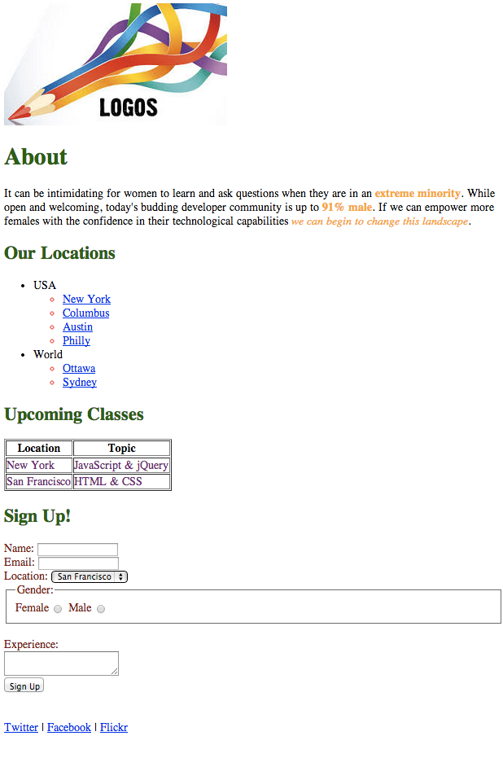
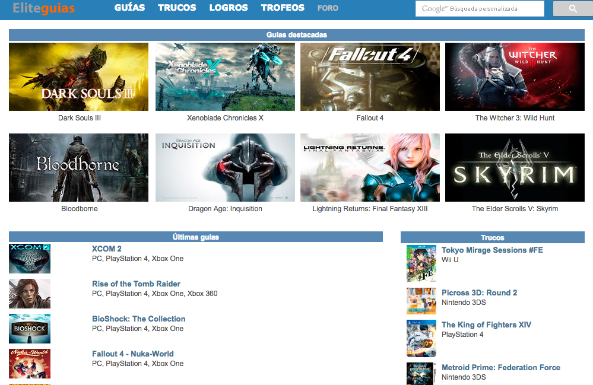
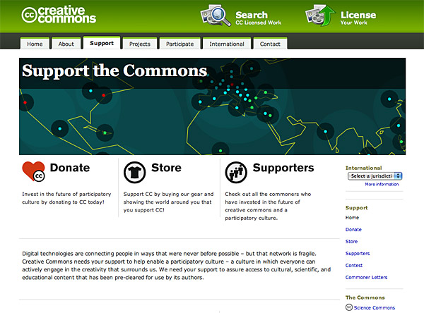

## HTML & CSS MARKUP

http://www.w3schools.com/tags/ <- List of all tags of HTML lenguage

*Basic estructure for HTML main page*

####Exercise: 
Do the semantic markup for the following image(**no styles**, only semantic HTML).

---

--- 

---

---

---

